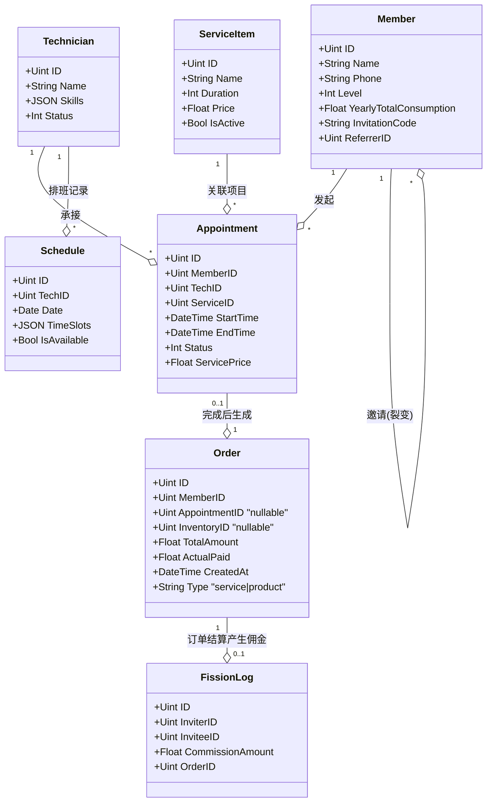
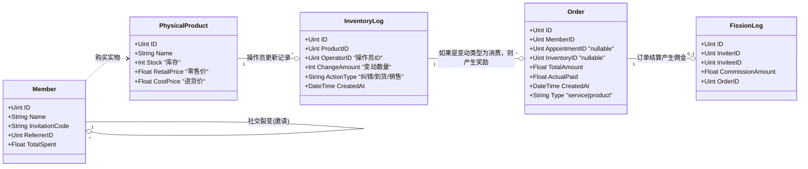

## 服务类

```mermaid
classDiagram
    direction TB
    class Member {
        +Uint ID
        +String Name
        +String Phone
        +Int Level
        +Float YearlyTotalConsumption
        +String InvitationCode
        +Uint ReferrerID
    }

    class Technician {
        +Uint ID
        +String Name
        +JSON Skills
        +Int Status
    }

    class ServiceItem {
        +Uint ID
        +String Name
        +Int Duration
        +Float Price
        +Bool IsActive
    }

    class Appointment {
        +Uint ID
        +Uint MemberID
        +Uint TechID
        +Uint ServiceID
        +DateTime StartTime
        +DateTime EndTime
        +Int Status
        +Float ServicePrice
    }

    class Schedule {
        +Uint ID
        +Uint TechID
        +Date Date
        +JSON TimeSlots
        +Bool IsAvailable
    }

    class FissionLog {
        +Uint ID
        +Uint InviterID
        +Uint InviteeID
        +Float CommissionAmount
        +Uint OrderID
    }

    %% 关联关系
    Member "1" --o "*" Appointment : 发起
    Technician "1" --o "*" Appointment : 承接
    ServiceItem "1" --o "*" Appointment : 关联项目
    Technician "1" --o "*" Schedule : 排班记录
    Member "1" --o "*" Member : 邀请(裂变)

    class Order {
        +Uint ID
        +Uint MemberID
        +Uint AppointmentID "nullable"
        +Uint InventoryID "nullable"
        +Float TotalAmount
        +Float ActualPaid
        +DateTime CreatedAt
        +String Type "service|product"
    }

    Appointment "0..1" --o "1" Order : 完成后生成
    Order "1" --o "0..1" FissionLog : 订单结算产生佣金
```

## 实物类

```mermaid
classDiagram
    direction LR
    class PhysicalProduct {
        +Uint ID
        +String Name
        +Int Stock "库存"
        +Float RetailPrice "零售价"
        +Float CostPrice "进货价"
    }

    class InventoryLog {
        +Uint ID
        +Uint ProductID
        +Uint OperatorID "操作员ID"
        +Int ChangeAmount "变动数量"
        +String ActionType "纠错/到货/销售"
        +DateTime CreatedAt
    }

    class Member {
        +Uint ID
        +String Name
        +String InvitationCode
        +Uint ReferrerID
        +Float TotalSpent
    }

    class FissionLog {
        +Uint ID
        +Uint InviterID
        +Uint InviteeID
        +Float CommissionAmount
        +Uint OrderID
    }

    class Order {
        +Uint ID
        +Uint MemberID
        +Uint AppointmentID "nullable"
        +Uint InventoryID "nullable"
        +Float TotalAmount
        +Float ActualPaid
        +DateTime CreatedAt
        +String Type "service|product"
    }

    %% 关联关系
    PhysicalProduct "1" --o "*" InventoryLog : 操作员更新记录
    Member "1" --o "*" Member : 社交裂变(邀请)
    InventoryLog "1" --o "*" Order: 如果是变动类型为消费，则产生奖励
    Member ..> PhysicalProduct : 购买实物
    Order "1" --o "0..1" FissionLog : 订单结算产生佣金
```
