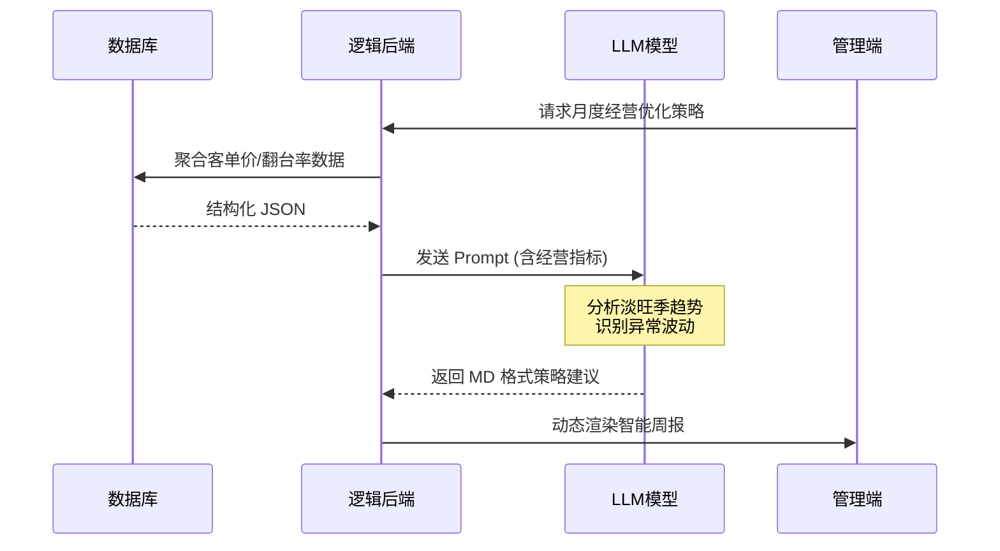
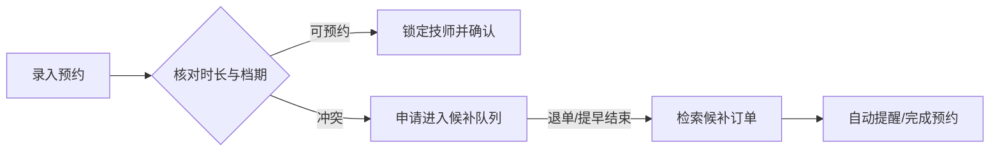
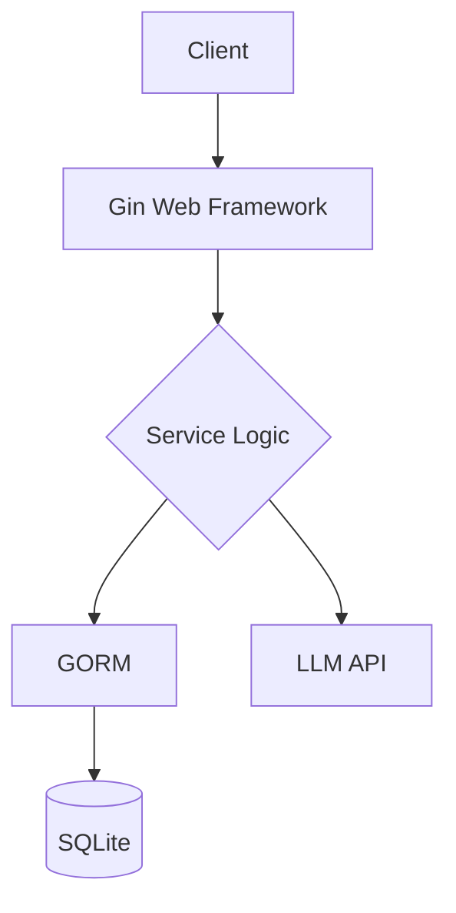

# 营销型养生店管理系统

## 高嘉兴

### 2026年1月

<div @click="$slidev.nav.next" class="mt-12 py-1 cursor-pointer" hover:bg="white op-10">
  开始演示 <carbon:arrow-right />
</div>


---
layout: center
---

<Toc />

---
layout: center
---

# 项目背景

传统养生店面临的“三大困境”：

### 运营

依赖纸质或初级系统，技师排班与资源调度难，导致人效浪费与预约冲突。

### 增长

缺乏数字化营销，老客粘性弱，新客留存难。

### 决策

海量经营数据被闲置，经营者难以捕捉市场趋势，难以预判市场波动与潜在风险。

---

# 需求分析

构建全方位的数字化闭环

<div class="grid grid-cols-3 gap-x-10 gap-y-6 pt-10">
  <div class="flex items-start gap-3">
    <carbon:dashboard class="text-emerald-500 text-2xl" />
    <div>
      <b class="block">可视化看板</b>
      <span class="text-xs opacity-60">LLM 辅助经营决策</span>
    </div>
  </div>
  <div class="flex items-start gap-3">
    <carbon:collaborate class="text-emerald-500 text-2xl" />
    <div>
      <b class="block">会员管理 & 裂变分销</b>
      <span class="text-xs opacity-60">RFM模型与分级激励;</span>
      <span class="text-xs opacity-60">社交驱动的二级分佣机制</span>
    </div>
  </div>
  <div class="flex items-start gap-3">
    <carbon:box class="text-emerald-500 text-2xl" />
    <div>
      <b class="block">养生产品与资源管理</b>
      <span class="text-xs opacity-60">实体产品、养生服务与技师关联管理</span>
    </div>
  </div>
  <div class="flex items-start gap-3">
    <carbon:event-schedule class="text-emerald-500 text-2xl" />
    <div>
      <b class="block">候补与预约调度</b>
      <span class="text-xs opacity-60">技师档期自动冲突检测</span>
    </div>
  </div>
  <div class="flex items-start gap-3">
    <carbon:security class="text-emerald-500 text-2xl" />
    <div>
      <b class="block">角色权限隔离</b>
      <span class="text-xs opacity-60">细粒度的门店权限控制</span>
    </div>
  </div>
</div>

<div class="text-[10px] opacity-60 mt-12">
RFM 模型（最近性、频率、金额）用于量化会员价值，支撑精准激励与分级运营
</div>

---
layout: two-cols
hideInToc: true
---

# 01. 数据驱动的“店长助手”

<div class="space-y-6 mt-6 ml-4">
  <div class="flex items-start gap-4">
    <carbon:document-view class="text-xl text-emerald-500 mt-1" />
    <div>
      <h4 class="font-bold">多维Dashboard</h4>
      <p class="text-xs opacity-80">日活/月收/技师完成订单实时监控</p>
    </div>
  </div>

  <div class="flex items-start gap-4">
    <carbon:ai-results class="text-xl text-blue-500 mt-1" />
    <div>
      <h4 class="font-bold">LLM分析经营数据</h4>
      <p class="text-xs opacity-80">基于近30天经营数据，生成Markdown格式的经营分析周报</p>
      <p class="text-xs opacity-80">分析淡旺季趋势，给出项目上下架建议</p>
    </div>
  </div>

  <div class="flex items-start gap-4">
    <carbon:chart-multitype class="text-xl text-purple-500 mt-1" />
    <div>
      <h4 class="font-bold">可视化</h4>
      <p class="text-xs opacity-80">折线图/饼图展示营收趋势、会员增长与项目销售排行</p>
      <p class="text-xs opacity-80">日历图、泳道图展示技师每月排班、每日预约状态</p>
    </div>
  </div>
</div>

::right::

<div class="mt-12 scale-90">


</div>

---
layout: two-cols
hideInToc: true
---

# 02. 会员管理 & 裂变分销

目标：提升客户留存率与复购率

<div class="border border-emerald-500/20 p-6 rounded-2xl relative overflow-hidden mr-8">
  <carbon:id-management class="absolute -right-4 -bottom-4 text-8xl opacity-5" />
  <h3 class="text-emerald-600 font-bold mb-4 flex items-center gap-2">
    <carbon:vmdk-disk /> 会员生命周期
  </h3>
  <ul class="text-sm space-y-3">
    <li class="flex justify-between"><span>新客首单奖励</span> <span class="text-xs px-2 bg-emerald-100 text-emerald-700 rounded">获客</span></li>
    <li class="flex justify-between"><span>RFM 自动标签</span> <span class="text-xs px-2 bg-blue-100 text-blue-700 rounded">画像</span></li>
    <li class="flex justify-between"><span>会员专属福利、沉睡用户预警</span> <span class="text-xs px-2 bg-red-100 text-red-700 rounded">留存</span></li>
  </ul>
</div>

<div class="text-[10px] opacity-60 mt-12">
RFM 模型（最近性、频率、金额）用于量化会员价值，支撑精准激励与分级运营
</div>
<div class="text-[10px] opacity-60 mt-0">
沉睡用户: 超过90天未消费的会员，系统自动预警并推送专属优惠券以促进复购
</div>

::right::

<div class="border border-amber-500/20 p-6 rounded-2xl relative overflow-hidden">
  <carbon:share-knowledge class="absolute -right-4 -bottom-4 text-8xl opacity-5" />
  <h3 class="text-amber-600 font-bold mb-4 flex items-center gap-2">
    <carbon:network-3 /> 社交裂变系统
  </h3>

  <div class="flex justify-center items-center gap-6 pt-4 mt-10">
      <div class="flex flex-col items-center">
          <carbon:share-knowledge class="text-3xl text-blue-500 mb-1" />
          <span class="text-sm">邀请激励</span>
          <p class="text-[10px] opacity-60">专属参数链接/二维码</p>
      </div>
      <carbon:arrow-right class="text-lg" />
      <div class="flex flex-col items-center">
          <carbon:user-follow class="text-3xl text-green-500 mb-1" />
          <span class="text-sm">用户注册</span>
          <p class="text-[10px] opacity-60">自动关联邀请链路</p>
      </div>
      <carbon:arrow-right class="text-lg" />
      <div class="flex flex-col items-center">
          <carbon:money class="text-3xl text-yellow-500 mb-1" />
          <span class="text-sm">消费返利</span>
          <p class="text-[10px] opacity-60">按比例结算返现</p>
      </div>
  </div>
</div>

---
layout: two-cols
hideInToc: true
---

# 03. 养生产品与资源管理

<div class="space-y-4 mt-6">
  <div class="flex gap-4 items-center p-3 hover:bg-main/5 transition-colors rounded">
    <carbon:shopping-bag class="text-2xl text-main" />
    <div>
      <h4 class="font-bold text-sm">产品管理</h4>
      <p class="text-[10px] opacity-60">服务类产品设定标准时长与缓冲时间</p>
      <p class="text-[10px] opacity-60">实体类产品支持按零售或附属耗材管理</p>
    </div>
  </div>

  <div class="flex gap-4 items-center p-3 hover:bg-main/5 transition-colors rounded">
    <carbon:user-role class="text-2xl text-main" />
    <div>
      <h4 class="font-bold text-sm">技师资源建模</h4>
      <p class="text-[10px] opacity-60">技能标签化管理（足疗、SPA、中医推拿等）</p>
      <p class="text-[10px] opacity-60">排班与档期冲突检测</p>
    </div>
  </div>
</div>

::right::

<div class="pl-8 flex flex-col items-center justify-center h-full">
  <div class="bg-white p-2 rounded shadow-lg border border-black/5 rotate-1">
    
  </div>
  <div class="bg-white p-2 rounded shadow-lg border border-black/5 -rotate-2 -mt-10 -ml-10">
    
  </div>
</div>

---
hideInToc: true
---

# 04. 预约与候补调度

核心：减少人工失误，提升资源利用率

<div class="mt-8">



</div>

<div class="grid grid-cols-2 gap-4 mt-8">
  <div>
  <b>✅ 自动分配</b><br>
  系统实时核对“项目时长+技师档期”，自动返回可用时段。
  </div>
  <div>
  <b>⏳ 候补机制</b><br>
  当资源已满时支持挂起。一旦产生空档，立即检索队列并通知用户。
  </div>
</div>

---
hideInToc: true
---

# 05. 基于角色权限管理

<p class="opacity-70 -mt-2">基于角色访问控制：确保门店数据安全与操作合规</p>

<div class="col-span-2 overflow-hidden border border-gray-400/10 rounded-xl shadow-sm bg-gray-400/5">
  <!-- center align -->
  <table class="w-full text-left border-collapse text-sm">
    <thead class="bg-main/10 text-main font-bold">
      <tr>
        <th class="p-3 border-b border-gray-400/10">流程类别</th>
        <th class="p-3 border-b border-gray-400/10">功能详情</th>
        <th class="p-3 border-b border-gray-400/10">店长 (Admin)</th>
        <th class="p-3 border-b border-gray-400/10">操作员 (Staff)</th>
      </tr>
    </thead>
    <tbody class="opacity-90">
      <tr class="hover:bg-main/5 transition-colors">
        <td class="p-3 border-b border-gray-400/10 font-bold">产品管理</td>
        <td class="p-3 border-b border-gray-400/10">录入 / 编辑 / 下架</td>
        <td class="p-3 border-b border-gray-400/10"><carbon:checkmark class="text-emerald-500 inline" /></td>
        <td class="p-3 border-b border-gray-400/10 text-xs text-orange-500 font-bold">需审批</td>
      </tr>
      <tr class="hover:bg-main/5 transition-colors">
        <td class="p-3 border-b border-gray-400/10 font-bold">产品管理</td>
        <td class="p-3 border-b border-gray-400/10">更新库存信息</td>
        <td class="p-3 border-b border-gray-400/10"><carbon:checkmark class="text-emerald-500 inline" /></td>
        <td class="p-3 border-b border-gray-400/10"><carbon:checkmark class="text-emerald-500 inline" /></td>
      </tr>
      <tr class="hover:bg-main/5 transition-colors">
        <td class="p-3 border-b border-gray-400/10 font-bold">资源调度</td>
        <td class="p-3 border-b border-gray-400/10">技师排班 / 技能管理</td>
        <td class="p-3 border-b border-gray-400/10"><carbon:checkmark class="text-emerald-500 inline" /></td>
        <td class="p-3 border-b border-gray-400/10 text-xs text-orange-500 font-bold">需审批</td>
      </tr>
      <tr class="hover:bg-main/5 transition-colors">
        <td class="p-3 border-b border-gray-400/10 font-bold">数据看板</td>
        <td class="p-3 border-b border-gray-400/10">薪资/敏感绩效查看</td>
        <td class="p-3 border-b border-gray-400/10 text-xs bg-emerald-500/10">全可见</td>
        <td class="p-3 border-b border-gray-400/10 text-xs bg-gray-500/10">仅个人</td>
      </tr>
      <tr class="hover:bg-main/5 transition-colors">
        <td class="p-3 font-bold">营销列表</td>
        <td class="p-3 border-b border-gray-400/10">裂变追踪与返利管理</td>
        <td class="p-3 border-b border-gray-400/10"><carbon:checkmark class="text-emerald-500 inline" /></td>
        <td class="p-3 border-b border-gray-400/10"><carbon:checkmark class="text-emerald-500 inline" /></td>
      </tr>
    </tbody>
  </table>
</div>

---
layout: two-cols
---

# 后端技术选型

<div class="mt-10 space-y-4">
  <div class="flex items-center gap-3">
    <logos-go class="text-3xl" />
    <div>
      <b>Gin GORM</b>
      <p class="text-xs opacity-60">低内存占用，高性能处理，保障预约调度的实时性</p>
    </div>
  </div>
  <div class="flex items-center gap-8">
    <logos-sqlite class="text-3xl" />
    <div>
      <b>SQLite</b>
      <p class="text-xs opacity-60">嵌入式数据库，单文件存储，低内存占用</p>
    </div>
  </div>
</div>

<div class="text-[10px] opacity-60 mt-12">

| 特性 | MySQL            | SQLite         |
| ---- | ---------------- | -------------- |
| 架构 | Client/Server    | Embedded       |
| 部署 | 需安装           | 随程序打包     |
| 数据 | 多目录，文件存储 | 单个`*.db`文件 |

</div>

::right::

<div class="ml-10">



</div>

---
layout: two-cols
---

# 前端技术选型

<p class="opacity-70 -mt-2">基于现代前端生态构建高效、响应式的管理系统</p>

<!-- 左侧：核心开发框架 -->
<div class="space-y-4 pr-6">
  <div class="p-4 border border-green-500/20 bg-green-500/5 rounded-lg">
    <h3 class="flex items-center gap-2 text-green-500 !mt-0">
      <logos-vue /> Vue 3
    </h3>
    <p class="text-xs opacity-80 mb-0">响应式数据绑定：数据变化自动更新视图</p>
    <p class="text-xs opacity-80 mb-2">组件化开发：页面拆分为可复用组件</p>
  </div>

  <div class="p-4 border border-blue-500/20 bg-blue-500/5 rounded-lg">
    <h3 class="flex items-center gap-2 text-blue-500 !mt-0">
      <carbon:network-4 /> 前后端通讯：Axios + RESTful API
    </h3>
    <p class="text-xs opacity-80 mb-2">前后端分离，使用Axios请求后端RESTFul API</p>
```http
GET   /api/v1/appointments   # 预约查询
POST  /api/v1/appointments   # 预约创建
PATCH /api/v1/appointments   # 预约更新
DELETE /api/v1/appointments  # 预约取消
```
    <p class="text-xs opacity-80 mb-0">支持异步等待网络IO</p>
  </div>
</div>

::right::

<div class="space-y-4 pl-6 mt-20">
  <div class="p-4 border border-yellow-500/20 bg-yellow-500/5 rounded-lg">
    <h3 class="flex items-center gap-2 text-yellow-600 !mt-0">
      <logos-vitejs /> 工程化：Vite V7.3
    </h3>
    <ul class="text-sm space-y-2 opacity-90 mt-5">
      <li class="flex items-start">
        <span>热更新：基于原生 ESM 的秒级热更新 (HMR)</span>
      </li>
      <li class="flex items-start">
        <span>优化构建：Rollup 驱动的高效资源打包</span>
      </li>
    </ul>
  </div>

  <div class="p-4 border border-indigo-500/20 bg-indigo-500/5 rounded-lg">
    <h3 class="flex items-center gap-2 text-indigo-500 !mt-0">
      <logos-tailwindcss-icon /> UIUX：Tailwind + Daisy UI V5
    </h3>
    <ul class="text-sm space-y-2 opacity-90 mt-5">
      <li class="flex items-start">
        <span>Tailwind CSS：原子化CSS框架，快速构建响应式App，保证PC/Mobile端一致体验</span>
      </li>
      <li class="flex items-start">
        <span>Daisy UI：基于 Tailwind 的组件库，提升开发效率</span>
      </li>
    </ul>
  </div>

  <!-- 底部标签 -->
  <div class="flex justify-center gap-4 py-2 border-t border-gray-200/10">
    <span class="flex items-center gap-1 text-[10px] opacity-50"><carbon:cloud /> Bun: 包管理</span>
    <span class="flex items-center gap-1 text-[10px] opacity-50"><carbon:code /> Biome: 代码Linter/Formatter</span>
  </div>

</div>

---
layout: two-cols
---

# 项目可行性与迭代路线

## 可行性

<div class="space-y-4 pr-12">
  <div class="text-[12px] space-y-3">
    <p>
      <b class="text-emerald-600">社会可行性：</b>
      根据行业效率痛点，通过数字化字段实现服务提质增效；并通过会员权益、邀请激励等合法方式构建“引流-留存”闭环。
    </p>
    <p>
      <b class="text-emerald-600">技术可行性：</b>
      Go + Gin 驱动高并发后端，Vue + Tailwind + Daisy UI 目前具有成熟的生态支持，开发效率高且易维护
    </p>
    <p>
      <b class="text-emerald-600">工程与部署：</b>
      后端使用Go编译为单一二进制文件，配合轻量级SQLite数据库，极大简化部署与运维复杂度。
    </p>
  </div>
</div>

::right::

## 迭代路线

按照敏捷开发模式，将项目拆分成多个Sprint，每个Sprint按照以下步骤执行：

<div class="relative border-l border-dashed border-main/40 pl-6">
  <div class="mt-4 space-y-4 text-[13px]">
    <div class="relative">
      <div class="absolute -left-[31px] w-3 h-3 bg-emerald-500 rounded-full shadow-sm"></div>
      <b>Step 1</b><br/>
      <span class="opacity-60">需求细化 数据库设计</span>
    </div>
    <div class="relative">
      <div class="absolute -left-[31px] w-3 h-3 bg-gray-300 rounded-full"></div>
      <b>Step 2</b><br/>
      <span class="opacity-60">后端API实现</span>
    </div>
    <div class="relative">
      <div class="absolute -left-[31px] w-3 h-3 bg-gray-300 rounded-full"></div>
      <b>Step 3</b><br/>
      <span class="opacity-60">前端UI构建</span>
    </div>
    <div class="relative">
      <div class="absolute -left-[31px] w-3 h-3 bg-gray-300 rounded-full"></div>
      <b>Step 4</b><br/>
      <span class="opacity-60">测试发版</span>
    </div>
  </div>
</div>

---
layout: center
hideInToc: true
---

# 谢谢
